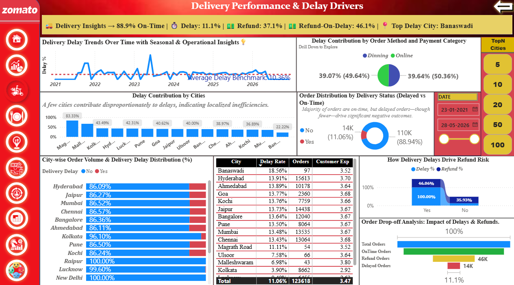
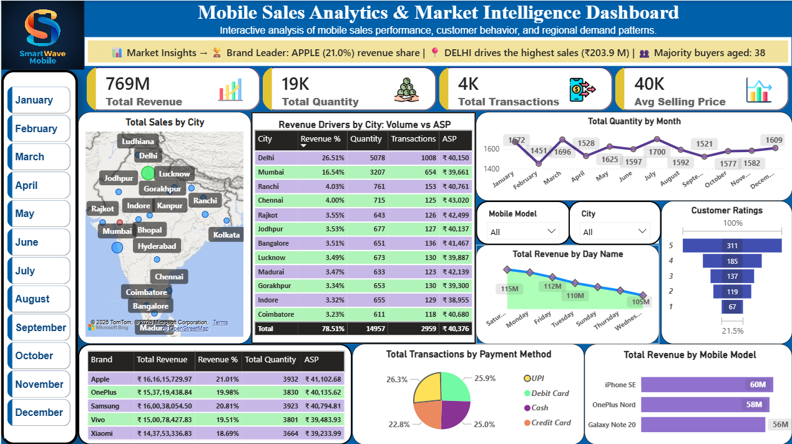

## Insights-to-Impact

### 📊 Business Analytics Portfolio :

A portfolio of business-focused analytics projects transforming data into actionable insights using **Power BI.**

📊 **_Turning Data into Business Decisions_**

Welcome to my analytics portfolio, where I transform raw data into actionable insights that drive business impact.
This repository showcases end-to-end Power BI projects focused on solving real-world business problems through data analysis, visualization, and storytelling.

🔍 **_What You'll Find Here_**

* Data-driven business insights
* Interactive Power BI dashboards
* Analytical problem-solving approach
* Clear storytelling with actionable outcomes

 ## 🚀 Featured Projects

 #### 1. 🍽️ Zomato Revenue Intelligence & Operational Risk Analytics

<i>“ I have built a multi-page Power BI report delivering revenue insights, Repeat Behavior, operational risk analysis, Sentiment Analysis, and customer behavior intelligence across 11 interactive dashboards. ”</i>

---
### 📊 Dashboard Preview

  

  

  

  <b>Explore the Multi-Page Report:</b>  
  ⚠️ <a href="Zomato-Analytics/README.md#operational-risk">Risk</a> •
  🍽️ <a href="Zomato-Analytics/README.md#cuisine">Cuisine</a> •
  🏪 <a href="Zomato-Analytics/README.md#restaurant">Restaurant</a> •
  💳 <a href="Zomato-Analytics/README.md#payment">Payment</a> •
  🔁 <a href="Zomato-Analytics/README.md#repeat-customer">Repeat</a> •
  🌍 <a href="Zomato-Analytics/README.md#heatmap">HeatMap</a> •
  🎯 <a href="Zomato-Analytics/README.md#strategy">Strategy</a> •
  📊 <a href="Zomato-Analytics/README.md#summary">Summary</a>

🔗 [View Full Project →](Zomato-Analytics/README.md)

---

#### 2. SmartWave Mobile Sales Dashboard  

🔗 [View Project](Smartwave-Mobile-Sales-Dashboard)

👩‍💻 **_Author’s Statement_**

**These projects demonstrates my ability to:**

• Translate business problems into analytical solutions  
• Design intuitive and interactive dashboards  
• Extract actionable insights from complex datasets  
• Communicate findings effectively through data storytelling  

📬 **_Let's Connect_**

If you're looking for a Business Analyst who can turn data into insights, feel free to connect with me.

LinkedIn: (www.linkedin.com/in/suchismita-naik17)
