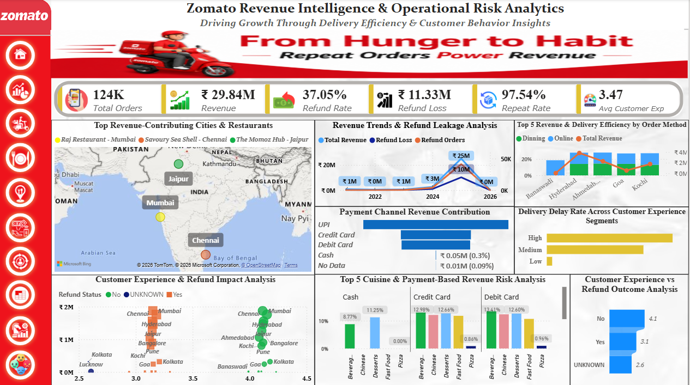
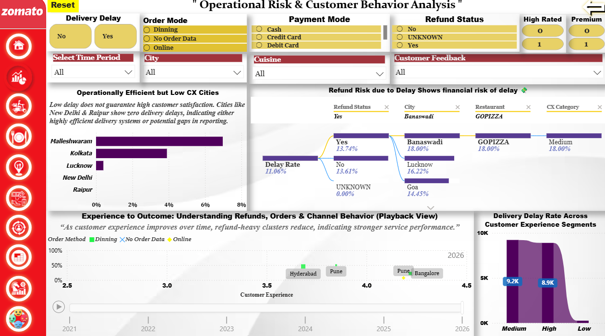
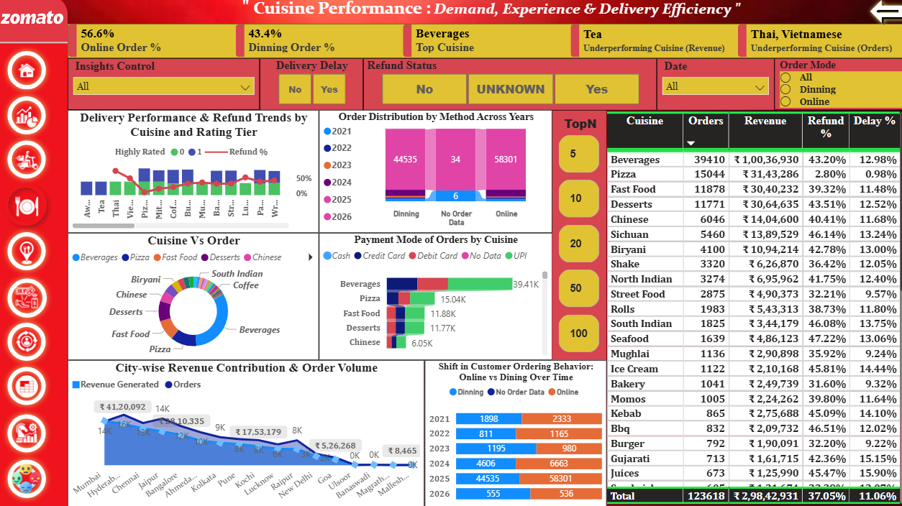
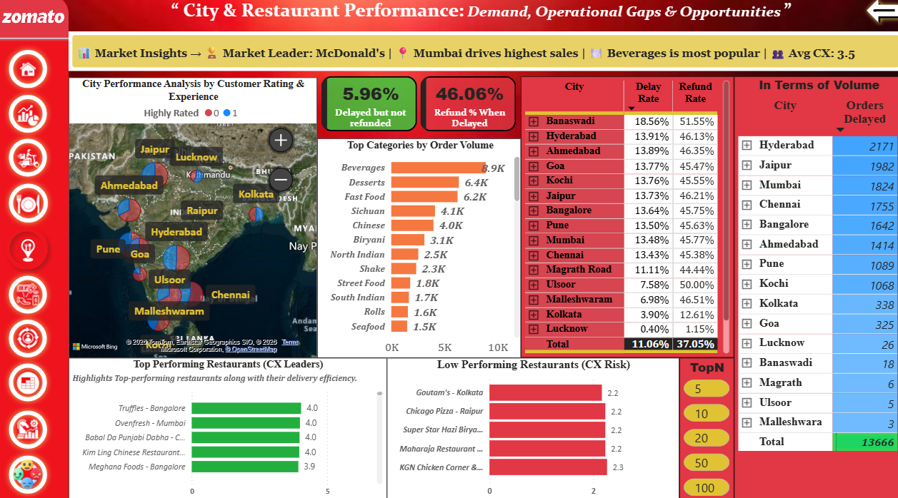
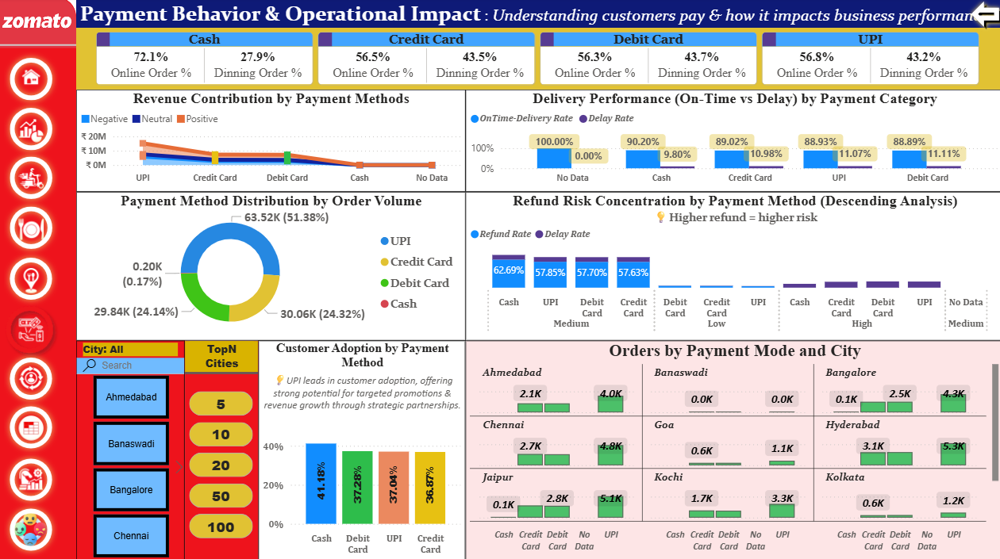
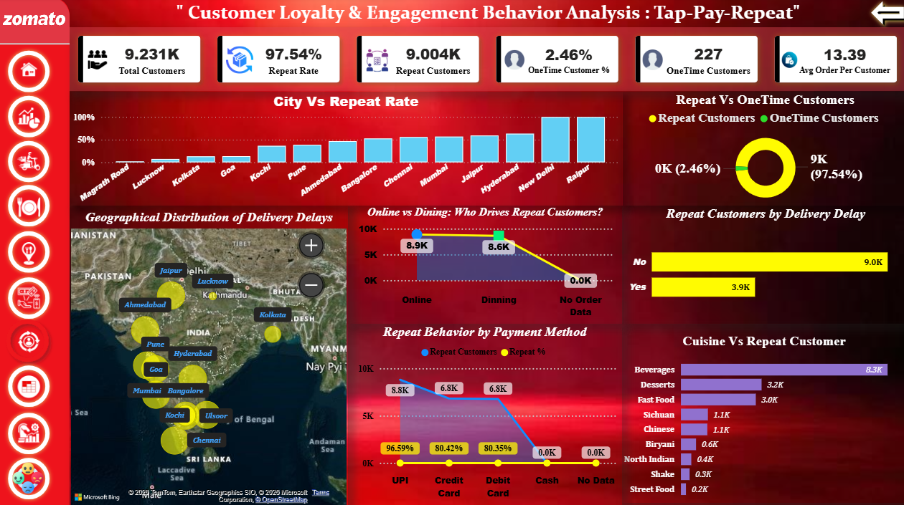
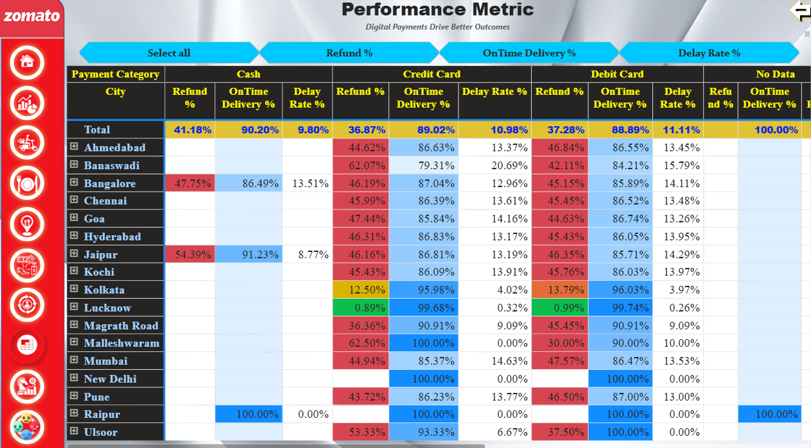
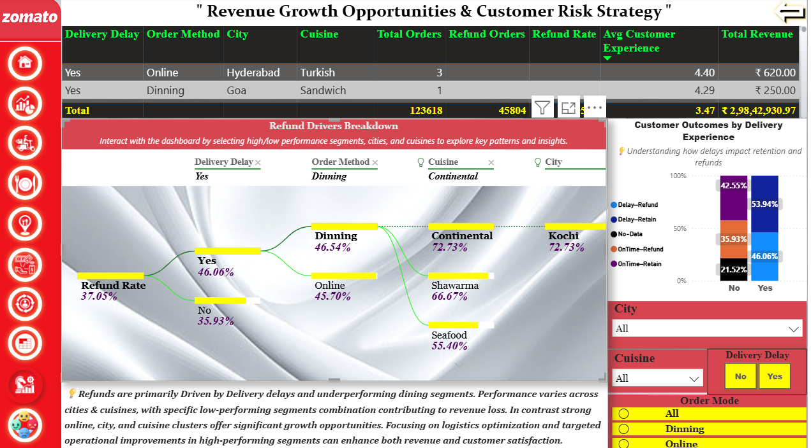
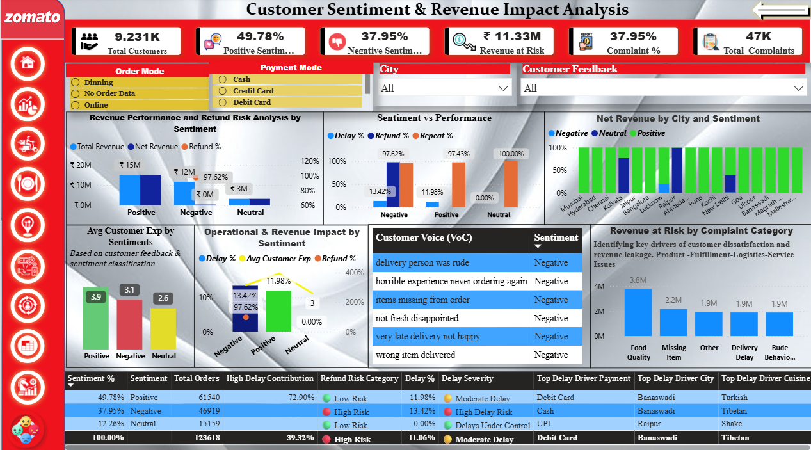
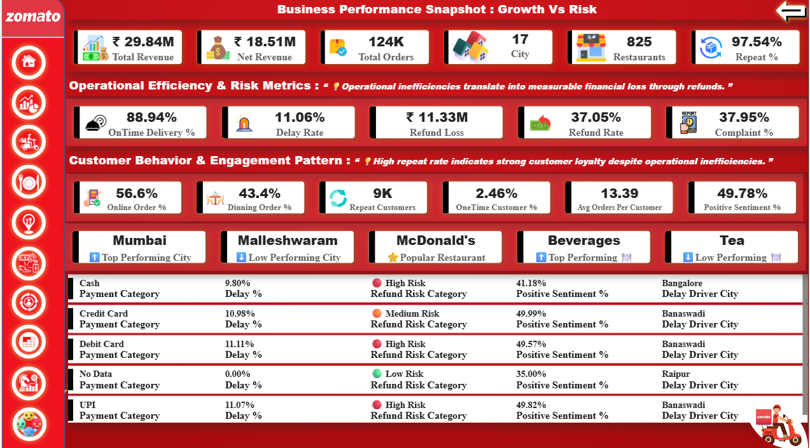

<h2 align="center">🍽️ Zomato Revenue Intelligence & Operational Risk Analytics</h2>

<p align="center">
  
</p>

<p align="center">
  <b><b>Explore the Multi-Page Report-Style Dashboard & Key Insights</b></b><br><br>

  🏠 <a href="#home-page">Home</a> •
  ⚠️ <a href="#operational-risk">Risk</a> •
  🚚 <a href="#delivery-performance">Delivery</a> •
  🍽️ <a href="#cuisine">Cuisine</a> •
  🏪 <a href="#restaurant">Restaurant</a> •
  💳 <a href="#payment">Payment</a> •
  🔁 <a href="#repeat-customer">Repeat</a> •
  🌍 <a href="#heatmap">HeatMap</a> •
  🎯 <a href="#strategy">Strategy</a> •
  🧠 <a href="#sentiment-analysis">Sentiment</a> •
  📊 <a href="#summary">Summary</a>

</p>


 ### 📌 Introduction

In today’s hyper-competitive food delivery market, sustainable growth is no longer defined by order volume alone — it is powered by retention, operational efficiency, and customer experience. While platforms like Zomato continue to scale rapidly, a deeper challenge emerges beneath the surface:

**Why does strong revenue growth not translate into consistent profitability and long-term customer loyalty?**

---

### 🚀 Project Overview

This project delivers an end-to-end analytics solution to uncover **revenue leakage, operational inefficiencies, and customer behavior patterns** at Zomato. It explores how the platform can evolve from merely fulfilling hunger to building **habitual customer engagement**. By analyzing order-level data acros revenue patterns, delivery performance, Customer behavior. The project identifies Key drivers of repeat orders, Operational inefficiencies, Financial risks impacting sustainable growth.

This solution integrates:
**Excel, MySQL, Power BI, and Python (NLP)** to transform raw transactional data into **actionable business intelligence**.

---

### 🎯 Business Problem & Objective

The core objective of this project is to investigate a critical business question:

> **Is the platform losing customers due to poor experience, or are operational inefficiencies silently eroding revenue?**

This project aims to bridge the gap between **apparent growth and actual business health**, uncovering whether performance is truly sustainable or impacted by hidden inefficiencies.

---

### 👥 Stakeholders

This analysis is designed to support key decision-makers across the organization:

* **Business Executives** – Monitor revenue quality and strategic growth drivers
* **Operations Team** – Identify and resolve delivery inefficiencies
* **Product & Customer Experience Teams** – Improve user journey and satisfaction
* **Marketing Team** – Optimize retention and engagement strategies
* **Finance Team** – Track revenue leakage, refunds, and financial health
* **Customers** – Benefit from improved service experience
* **Data Analytics Team** -Build predictive models and monitor KPI's
* **Restaurant Partners** - Improve fulfillment accuracy 

---

### 🧩 Solution Approach

To address the business challenges, the solution is structured as a **multi-page analytical dashboard**, where each page focuses on a specific business dimension.
Rather than presenting isolated metrics, the dashboard delivers a **connected business narrative**:

* **Revenue Analysis** → Identifies where value is generated vs lost
* **Delivery Insights** → Highlights operational inefficiencies impacting cost and experience
* **Customer Behavior** → Reveals drivers of retention and repeat orders
* **Payment & Refund Analysis** → Detects financial risk areas affecting profitability

Each dashboard view is built with a **clear decision-making objective**, enabling stakeholders to move from   **insight → action**. 
This approach ensures that every insight directly contributes to solving the core business problem:

 **<i>Improving revenue quality through operational efficiency and stronger customer retention</i>**

---

### ⚙️ Data Preparation & Processing

* Structured data pipeline: **Raw Layer → Clean Layer → Analysis Layer**
* Performed **data profiling** to assess data quality and identify inconsistencies
* Cleaned and transformed datasets for accurate analysis and reporting

---

### 🧰🛠️ Tools & Technologies used

* **Excel** – Data cleaning, preprocessing, formatting
* **MySQL** – Data transformation, querying, and exploratory analysis
* **Power BI** – Dashboard development and visualization
* **Power Query** – Data transformation within Power BI
* **Data Modeling** – Star schema design and relationship management
* **DAX** – KPI creation and advanced business calculations
* **Python (Pandas)** – Data processing and preparation

  
### 🤖 Sentiment Analysis (NLP)

* **pandas** – Data manipulation
* **nltk** – Text processing
* **textblob** – Sentiment scoring
* **vaderSentiment** – Rule-based sentiment analysis
* **openpyxl / xlrd** – Excel integration

---
## ⚙️ Data Pipeline: From Raw Data to Analytical Model

### 📂 Data Source & Preparation

### 🔹 Step 1: Data Sourcing

* Dataset sourced from Kaggle *(Zomato-like transactional dataset)*
* File available in `/dataset` folder
* **File Name:** `Zomato_Dataset.xlsx` (~123,618 rows)

The dataset contains detailed **order-level transactional data**, including:

* Customer IDs
* Order timestamps
* Delivery status
* Ratings *(Delivery, Service, Dining)*
* Refund information

⚠️ **Note:**
Payment method data was not available in the original dataset.
A separate **synthetic payment table** was created and integrated during the Power BI modeling phase.

---

### 🔹 Step 2: Data Cleaning (Excel)

Initial preprocessing was performed in Excel to ensure **data consistency and usability**.

* Automated repetitive tasks using **macros**
* Standardized formatting across the dataset

#### Key Cleaning Actions:

* Removed special characters *(₹, symbols, extra spaces)*
* Handled missing and null values
* Standardized categorical fields *(payment types, delay flags)*
* Ensured consistent formats across all columns

#### Techniques Used:

* Text-to-Columns
* Remove Duplicates
* Data Validation checks

---

### 🔹 Step 3: Data Transformation (MySQL)

A structured pipeline was built in MySQL to convert cleaned data into an **analysis-ready dataset**.

* Database created: `zomato_analysis`
* Data transformed for reporting and dashboarding

#### Key Transformations:

* Converted date fields into proper `DATE` format
* Removed duplicate records
* Handled missing values *(especially refund fields)*
* Created **Refund_Status** column *(Yes / No / Unknown)*

#### Derived Fields Created:

* Order Month
* Month-Year

---

### 🔍 Data Validation & Quality Check

To ensure reliability, validation queries were executed:

```sql
SELECT Refund_Requested, COUNT(*) AS total
FROM orders
GROUP BY Refund_Requested;
```

#### Findings:

* **NO** → 54,182
* **YES** → 45,818
* **UNKNOWN (Blank)** → 23,657

🔴 **Data Quality Insight:**
~19% of records had missing refund status — a critical issue that could significantly impact refund-related analysis and business decisions.

 💡 **<I>Decisions are only as good as the data behind them.</I>**

By cleaning missing values, standardizing formats, and structuring the dataset, a **reliable analytical foundation** was established for:

* Customer behavior analysis
* Refund tracking
* Time-based reporting
* KPI monitoring

---

### 🔹 Step 4: Data Modeling & Visualization (Power BI)

The transformed dataset was integrated into Power BI to develop an **interactive executive dashboard**.

#### 📊 Data Modeling:

* Designed a **Star Schema**:

  * Fact Table → Orders
  * Dimension Tables → Customer, Restaurant, Date, Items, Location

* Established relationships for:

  * Accurate filtering
  * Performance optimization

#### Key Capabilities:

* Defined KPIs using DAX *(Revenue, Repeat Rate, Refund %)*

* Built scalable model for multi-dimensional analysis

* Conducted exploratory analysis to detect:

  * Refund anomalies
  * Delivery delays
  * Revenue inconsistencies

* Designed **multi-page interactive dashboard** aligned with business decision-making

---

### 🔹 Step 5: Sentiment Analysis (Python - NLP)

Customer Feedbacks were analyzed to understand **experience and satisfaction trends**.

#### Process:

* 📌 Initial Data Understanding
* 🧹 Data Cleaning
* ✨ Text Preprocessing

#### Sentiment Analysis Tools:

* **TextBlob** – Polarity scoring
* **VADER** – Rule-based sentiment analysis

#### Output Classification:

* Positive
* Negative
* Neutral
---
## 📊 Dashboard Design: Consulting-Style Storytelling (10 Pages)

The dashboard follows a structured analytical flow:

> **What is happening → Why it is happening → What should be done**

Each page is designed as a **decision-making unit**, combining insights with business impact.

### 🏠 Home Page
<a id="home-page"></a>
#### 🟩 Page 1

<p align="center">
  
</p>

* ₹29.84M revenue generated, with a **37.05% refund rate**, indicating significant revenue leakage

 **<i>“Revenue is growing, but refund impact is increasing — signaling hidden inefficiencies.”</i>**

---
### ⚠️ Operational Risk 
<a id="operational-risk"></a>
#### 🟩 Page 2
<p align="right"><a href="#home-page">⬆ Back to Top</a></p>


<p align="center">
  
</p>

This page focuses on risk identification and behavioral patterns 

#### 🔍 Key Insights

* Delivery delays (~11.06%) directly increase refund risk
* Refunds strongly linked to **delays + medium experience ratings**
* Medium experience segment dominates delay volume → hidden dissatisfaction

#### 💡 Strategic Insight

* Revenue concentrated in Tier-1 cities → **growth risk**
* Limited cuisine diversity → **low market expansion potential**

---
### 🚚 Delivery Performance
<a id="delivery-performance"></a>
#### 🟩 Page 3
<p align="right"><a href="#home-page">⬆ Back to Top</a></p>

<p align="center">
  
</p>

This page provides a comprehensive analysis of delivery performance, focusing on delay patterns, refund risks, and customer experience across cities, order methods, and time.

#### 🔍 Key Insights

* ~89% on-time delivery, but **~11% delays drive disproportionate negative outcomes**
* High-delay contributors: **Banaswadi, Hyderabad, Jaipur**
* Strong correlation: **Delay → Refund → Revenue Loss**
* Seasonal delay spikes indicate **operational bottlenecks**

---
### 🍽️ Cuisine
<a id="cuisine"></a>
#### 🟩 Page 4
<p align="right"><a href="#home-page">⬆ Back to Top</a></p>

<p align="center">
  
</p>

#### 🔍 Key Insights

* **Beverages dominate** revenue and orders → high demand category
* Underperforming cuisines: **Thai, Vietnamese**
* Online orders (57%) > Dining (43%) → **digital-first behavior**
* Delays increase refund rates → operational mismatch
* Metro cities: high revenue but declining order trends

#### 💡 Strategic Insight

 **“High demand does not guarantee good experience — operational alignment is critical.”**

---
 ### 🏪 Restaurant
 <a id="restaurant"></a>
 #### 🟩 Page 5
 <p align="right"><a href="#home-page">⬆ Back to Top</a></p>

<p align="center">
  
</p>

#### 🔍 Key Insights

* High-demand cities (**Hyderabad, Jaipur, Mumbai**) show operational strain
* **Banaswadi** → highest delay (18.56%) & refund rate (51.55%) → risk hotspot
* Top restaurants: high ratings + high volume → efficient operations
* Bottom performers: low ratings despite demand → service gaps
* Issues are **geographically clustered**, not uniform

---
### 💳 Payment
<a id="payment"></a>
#### 🟩 Page 6
<p align="right"><a href="#home-page">⬆ Back to Top</a></p>

<p align="center">
  
</p>

👉 This page answers:
“How do customers prefer to pay, and how can Zomato use this behavior to increase revenue while managing risk?”

👉 **Payment Method → Performance → Risk → Experience**

#### 🔍 Key Insights

* **UPI dominates revenue (~₹15M)** → preferred payment method
* Digital payments > Cash → shift toward convenience
* Cash shows highest refund rate (~41%) → higher risk
* Delivery performance consistent across payment types (~88–90%)

#### 💡 Strategic Insight

* Payment behavior influences both **revenue distribution and risk exposure**

---
### 🔁 Repeat Customer
<a id="repeat-customer"></a>
#### 🟩 Page 7
<p align="right"><a href="#home-page">⬆ Back to Top</a></p>

<p align="center">
  
</p>

#### 🔍 Key Insights

* Extremely high repeat rate (~97.5%) → strong retention
* Online users show higher repeat behavior → digital engagement
* No-delay customers → significantly higher repeat rate
* UPI users show strongest retention
* Beverages & desserts → **habit-forming categories**

#### 💡 Strategic Insight

> **“Retention is strong — but dataset limits visibility into churn risk.”**

---
### 🌍HeatMap
<a id="heatmap"></a>
#### 🟩 Page 8
<p align="right"><a href="#home-page">⬆ Back to Top</a></p>

<p align="center">
  
</p>

#### 🔍 Key Insights

* Cash → highest refund rate (~41%)
* Digital payments → better balance (lower refunds + high on-time delivery)
* Some cities show **extreme refund rates (>60%)** → localized issues
* Strong correlation: **Delay ↔ Refund**

#### 💡 Strategic Insight

 **“Payment behavior is indirectly linked to customer experience and operational risk.”**

---
### 🎯Strategy
<a id="strategy"></a>
#### 🟩 Page 9
<p align="right"><a href="#home-page">⬆ Back to Top</a></p>

<p align="center">
  
</p>

#### 🔍 Key Insights

* Overall refund rate ~37%
* Delays significantly increase refunds (~46% vs ~35%)
* Dining orders show higher risk than online
* High-risk cities: **Mumbai, Goa, Kolkata**
* Specific cuisines show **extreme refund patterns (70–100%)**

#### 💡 Strategic Insight

 **“Refunds are not isolated — they are driven by combined factors (delay + location + cuisine + experience).”**

---
### 🧠Sentiment-Analysis
<a id="sentiment-analysis"></a>
#### 🟩 Page 10
<p align="right"><a href="#home-page">⬆ Back to Top</a></p>

<p align="center">
  
</p>

👉 This page connects **customer emotions → operational performance → revenue impact.**
*	We start by understanding how customers feel (Positive, Negative, Neutral) 
*	 Then link it to delivery performance (delays, refunds) 
*	 Finally measure how sentiment affects revenue and risk

#### 🔍 Key Insights

#### 💰 Revenue vs Sentiment

* Positive sentiment → healthy revenue
* Negative sentiment → high refund loss
* Neutral → opportunity segment

#### ⚠️ Refund Risk Pattern

* Negative sentiment shows:

  * High delays (~13%+)
  * Extremely high refund rates (~97%)

👉 **Delay → Complaint → Refund → Revenue Loss**

---

#### 🚚 Operational Drivers

* Late delivery
* Missing items
* Wrong items
* Poor delivery behavior

👉 Root cause: **operational inefficiencies**

---

#### 🌍 City-Level Risk

* Same cities show:

  * High delays
  * High negative sentiment
  * High revenue risk

---

#### 🔁 Repeat Behavior

* High repeat rate (~97%) despite issues

👉 Insight:

Customers stay, but experience is not optimal → **hidden churn risk**

---

#### 💳 Payment Impact

* Certain payment types linked to:

  * Higher delays
  * Higher refunds

👉 Possible causes:

* COD friction
* Refund processing delays

#### Customer Feedback

* Neutral Sentiment = Untapped Opportunity
  
A large neutral segment exists that:

* Is not fully satisfied
* Has potential to convert into loyal customers 

👉 Represents a key growth and retention opportunity 


 **<i> “Customer sentiment is not just feedback — it is a leading indicator of revenue health. Fixing customer experience directly improves profitability.”</i>**

---
###  📊 Summary
<a id="summary"></a>
#### 🟩 Page 11
<p align="right"><a href="#home-page">⬆ Back to Top</a></p>

<p align="center">
  
</p>

<i> **Revenue leakage is not due to lack of demand, but due to operational inefficiencies.** </i>

Key drivers:

* Delivery delays
* High-risk payment methods
* Underperforming city–cuisine combinations

---

### 🚀 Strategic Business Recommendations

#### 1. Optimize Delivery Operations

* Reduce delays in high-risk zones and cities
* Strengthen last-mile delivery efficiency
* Improve logistics planning during peak demand

---

#### 2. Drive Digital Payment Optimization

* Encourage **low-risk payment methods (Cards, UPI)**
* Reduce dependency on **Cash transactions**
* Streamline refund processing systems

---

#### 3. Fix Underperforming Segments

* Focus on low-performing cities *(e.g., Malleshwaram)*
* Improve vendor quality for high-refund cuisines
* Identify and resolve localized service gaps

---

#### 4. Scale High-Performing Areas

* Replicate operational strategies from **top-performing cities (e.g., Mumbai)**
* Invest further in **online ordering ecosystem**
* Expand high-performing cuisine categories

---
#### 5. Reduce Refund Leakage

*	Improve delivery SLAs 
*	Fix high-delay regions first 
*	Implement real-time delivery tracking alerts

---
#### 6. Customer Experience & Sentiment Impact

*	Train delivery partners 
*	Reduce wrong/missing items 
*	Faster complaint resolution
*	Positive customers generate the highest stable revenue with low refund risk 
* Negative sentiment is strongly tied to delays and refunds 
*	A significant portion of revenue is actually at risk due to poor experiences 
*	Even though repeat rate is high, bad experiences are silently hurting profitability

---

### 📈 Expected Business Impact

* ↓ Refund Rate → ↑ Profit Margins
* ↓ Delivery Delays → ↑ Customer Satisfaction
* ↑ Digital Payments → ↑ Operational Efficiency
* Targeted Fixes → ↑ Revenue Growth
* Data-Driven Decisions → ↑ Scalability

---

### Conclusion

<i> The business is **not demand-constrained — it is efficiency-constrained.**</i>

It isn't facing a demand problem — it is facing an execution problem.
Strong revenue, high repeat rates, and digital adoption exist, but delivery inefficiencies, service gaps, and localized issues are driving refunds, negative sentiment, and revenue leakage. Fixing these inefficiencies the platform can simultaneously reduce risk and unlock sustainable growth.

 <i>**Growth is strong, but efficiency gaps, delivery delays, and experience issues are silently eroding profitability.**</i>


 
